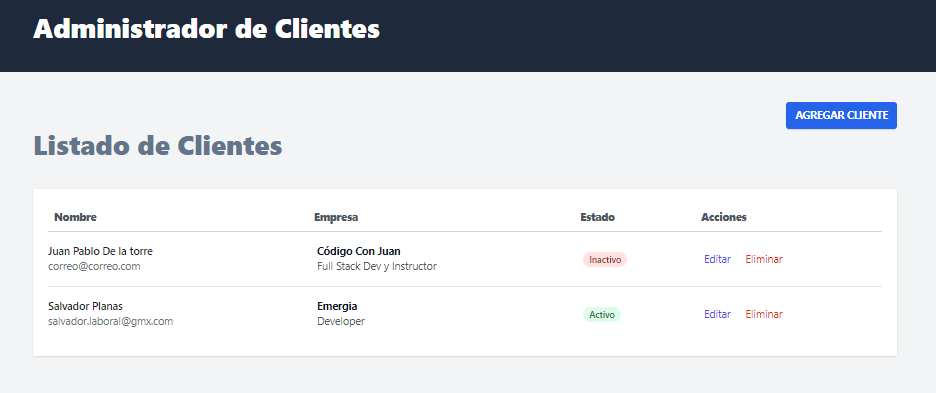
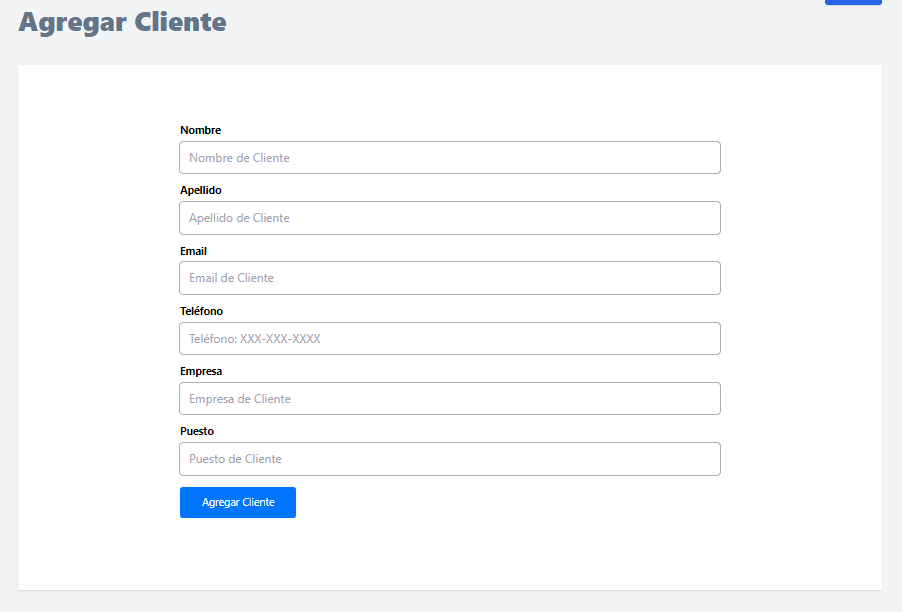

# Clientes CRM  
Proyecto realizado con VueJS que usa Vue-Router, Tailwindcss, JSON Server y REST API. Controla los clientes de una empresa.

### Vue Router 
Vue Router es la libería de Vue para el enrutado, ofrece una solución muy buena y fácil de implementar

```javascript
    npm create vue@latest
    (incluir vue-router)

```
En la carpeta "Router", hay el archivo  index.js en el cual se escriben todas las rutas y las views que renderiza cada ruta.

Hemos aprendido en este proyecto a usar el RouterLink, useRoute(), useRouter(), enviar datos a través del url, etc. 

Hemos hecho 3 rutas: inicial, /agregar-cliente/, editar-cliente/id

### JSON-Server

Hemos usado esta librería para simular una REST API para que localmente podamos guardar datos y simular las peticiones 

```javascript
    npm i -g json-server
    
    //crear archivo: 
    db.json

    // Terminal
    json-server --watch db.json --port 4000
```

### FormKit

Librería para hacer formularios en Vue, ofrece estilos, validaciones, etc.
Muy completa y muy recomendada usarla.
[Enlace](https://formkit.com/getting-started/what-is-formkit)

 - En main.js,
    ```javascript
        import {plugin, defaultConfig} from '@formik/vue'
        import {config} from 'formik.config.js'

        app.use(plugin, defaultConfig(config))
    ```
 -  Creamos archivo formkit.config.js
    ```javascript
        const config = {
            theme: 'genesis'
        }
        export default config;
    ```

### Axios
Librería de JS para request. Hemos creado un ClienteService.js el cual tiene todas los métodos de los request y devuelve unicamente el objeto de respuesta, sean datos o objeto de confirmacion/error

```javascript
    npm i axios

    // Ejemplo de peticion
```

# Imágenes del resultado


